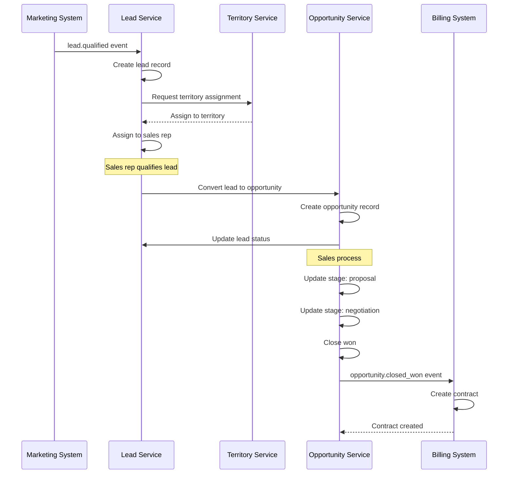
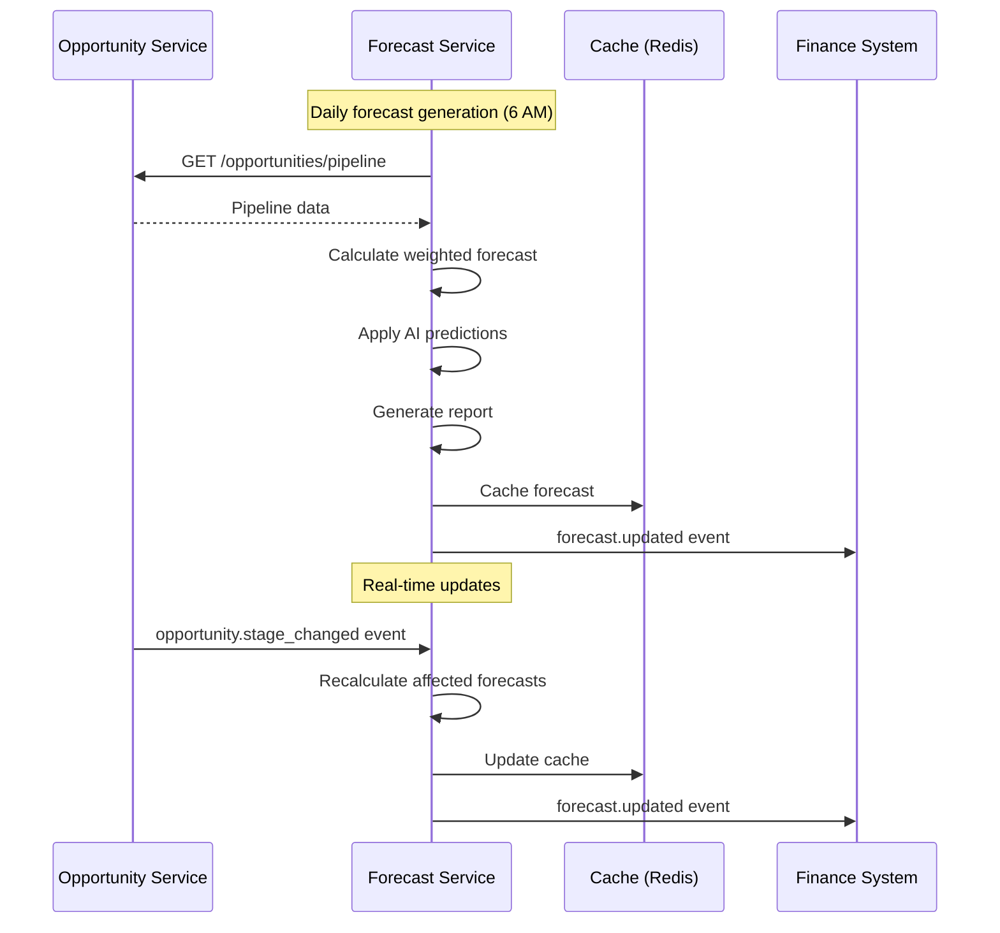
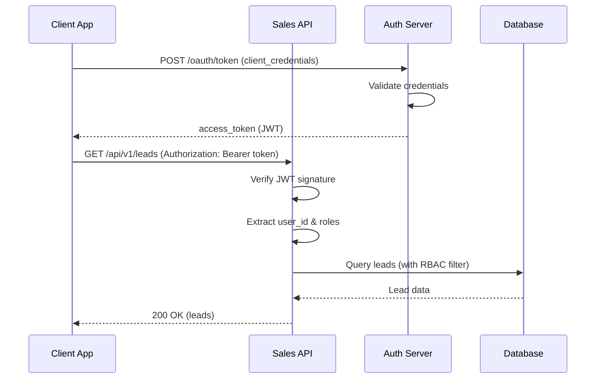

# Sales System Integration Specification

## System Dependencies

### Upstream Systems (Data Providers)

#### Marketing System
**Purpose**: Qualified lead handoff and lead scoring data

**Integration Type**: Event-driven + REST API

**Data Flow**:
```
Marketing System → Lead Service
- Lead qualification events
- Lead scoring updates
- Campaign attribution data
```

**Event Schema**:
```json
{
  "event_type": "lead.qualified",
  "timestamp": "2026-02-11T08:00:00Z",
  "payload": {
    "lead_id": "uuid",
    "source": "webinar",
    "score": 85,
    "campaign_id": "uuid",
    "attribution": {
      "first_touch": "paid_search",
      "last_touch": "webinar",
      "touches": ["paid_search", "email", "webinar"]
    },
    "profile": {
      "first_name": "John",
      "last_name": "Doe",
      "email": "john.doe@example.com",
      "company": "Acme Corp",
      "title": "VP Engineering",
      "phone": "+1-555-0100"
    },
    "firmographic": {
      "industry": "Technology",
      "employee_count": 500,
      "annual_revenue": 50000000
    }
  }
}
```

**API Endpoints**:
```
GET  /api/v1/campaigns/:id          - Campaign details for attribution
GET  /api/v1/leads/:id/score        - Current lead score
POST /api/v1/leads/:id/sync         - Sync lead data from marketing
```

#### Customer Experience System
**Purpose**: Account health scores and customer insights

**Integration Type**: REST API + Webhooks

**Data Flow**:
```
Customer Experience → Account Service
- Customer health scores
- Product usage metrics
- Support ticket history
- NPS scores
```

**API Endpoints**:
```
GET  /api/v1/accounts/:id/health     - Account health score (0-100)
GET  /api/v1/accounts/:id/usage      - Product usage metrics
GET  /api/v1/accounts/:id/tickets    - Recent support tickets
GET  /api/v1/accounts/:id/nps        - Latest NPS score
```

#### Support System
**Purpose**: Technical account information and escalation history

**Integration Type**: REST API

**Data Flow**:
```
Support System → Sales Intelligence Service
- Open critical tickets
- Escalation history
- Feature requests
- Technical health indicators
```

**API Endpoints**:
```
GET  /api/v1/accounts/:id/tickets/critical  - Critical open tickets
GET  /api/v1/accounts/:id/escalations       - Escalation history
GET  /api/v1/accounts/:id/feature-requests  - Active feature requests
```

### Downstream Systems (Data Consumers)

#### Billing System
**Purpose**: Deal closure notification and contract terms

**Integration Type**: Event-driven + REST API

**Data Flow**:
```
Opportunity Service → Billing System
- Deal closed events
- Contract terms
- Pricing information
- Payment schedules
```

**Event Schema**:
```json
{
  "event_type": "opportunity.closed_won",
  "timestamp": "2026-02-11T08:00:00Z",
  "payload": {
    "opportunity_id": "uuid",
    "account_id": "uuid",
    "amount": 120000.00,
    "contract_term": 12,
    "start_date": "2026-03-01",
    "payment_terms": "net_30",
    "billing_frequency": "monthly",
    "products": [
      {
        "product_id": "prod_123",
        "quantity": 100,
        "unit_price": 100.00,
        "discount": 0.10
      }
    ],
    "owner": {
      "user_id": "uuid",
      "name": "Jane Smith",
      "email": "jane.smith@ionoi-inc.com"
    }
  }
}
```

**API Endpoints**:
```
POST /api/v1/contracts              - Create contract from opportunity
GET  /api/v1/contracts/:id          - Contract details
PUT  /api/v1/contracts/:id          - Update contract terms
```

#### Finance System
**Purpose**: Revenue forecasts and commission calculations

**Integration Type**: Event-driven + Scheduled Sync

**Data Flow**:
```
Forecast Service → Finance System
- Monthly revenue forecasts
- Quarterly pipeline reports
- Commission-eligible deals
- Territory performance
```

**Event Schema**:
```json
{
  "event_type": "forecast.updated",
  "timestamp": "2026-02-11T08:00:00Z",
  "payload": {
    "period": "Q1_2026",
    "territory_id": "uuid",
    "forecast_type": "commit",
    "amount": 5000000.00,
    "probability_weighted_amount": 4250000.00,
    "breakdown": [
      {
        "stage": "negotiation",
        "count": 15,
        "total_amount": 2000000.00,
        "weighted_amount": 1800000.00
      }
    ],
    "generated_at": "2026-02-11T08:00:00Z"
  }
}
```

**API Endpoints**:
```
GET  /api/v1/forecasts/:period          - Forecast for period
POST /api/v1/commissions/calculate      - Calculate commissions
GET  /api/v1/revenue/:period            - Actual revenue for period
```

#### Operations System
**Purpose**: Customer onboarding triggers and provisioning

**Integration Type**: Event-driven

**Data Flow**:
```
Opportunity Service → Operations System
- Deal closed events
- Onboarding requirements
- Provisioning instructions
- Customer contact info
```

**Event Schema**:
```json
{
  "event_type": "onboarding.trigger",
  "timestamp": "2026-02-11T08:00:00Z",
  "payload": {
    "opportunity_id": "uuid",
    "account_id": "uuid",
    "account_name": "Acme Corp",
    "contract_start_date": "2026-03-01",
    "products": [
      {
        "product_id": "prod_123",
        "product_name": "Enterprise Plan",
        "quantity": 100,
        "configuration": {
          "data_center": "us-east-1",
          "features": ["sso", "advanced_analytics", "api_access"]
        }
      }
    ],
    "contacts": [
      {
        "type": "primary",
        "name": "John Doe",
        "email": "john.doe@acme.com",
        "phone": "+1-555-0100"
      }
    ],
    "special_requirements": "Requires custom integration with Salesforce",
    "priority": "high"
  }
}
```

## API Contracts

### Sales System REST API

#### Authentication
```
Authorization: Bearer {jwt_token}
X-API-Key: {api_key}
```

#### Lead Endpoints

**Create Lead**
```http
POST /api/v1/leads
Content-Type: application/json

{
  "source": "webinar",
  "first_name": "John",
  "last_name": "Doe",
  "email": "john.doe@example.com",
  "phone": "+1-555-0100",
  "company": "Acme Corp",
  "title": "VP Engineering",
  "industry": "Technology",
  "employee_count": 500,
  "annual_revenue": 50000000,
  "score": 85,
  "metadata": {
    "campaign_id": "uuid",
    "utm_source": "linkedin"
  }
}

Response: 201 Created
{
  "id": "uuid",
  "status": "new",
  "assigned_to": "uuid",
  "territory_id": "uuid",
  "created_at": "2026-02-11T08:00:00Z"
}
```

**Get Leads**
```http
GET /api/v1/leads?status=qualified&assigned_to=uuid&limit=50&offset=0

Response: 200 OK
{
  "data": [
    {
      "id": "uuid",
      "status": "qualified",
      "first_name": "John",
      "last_name": "Doe",
      "email": "john.doe@example.com",
      "company": "Acme Corp",
      "score": 85,
      "assigned_to": {
        "id": "uuid",
        "name": "Jane Smith"
      },
      "created_at": "2026-02-10T14:30:00Z",
      "updated_at": "2026-02-11T08:00:00Z"
    }
  ],
  "pagination": {
    "total": 250,
    "limit": 50,
    "offset": 0,
    "has_more": true
  }
}
```

**Convert Lead to Opportunity**
```http
POST /api/v1/leads/:id/convert
Content-Type: application/json

{
  "opportunity_name": "Acme Corp - Enterprise Plan",
  "amount": 120000.00,
  "expected_close_date": "2026-04-30",
  "stage": "discovery"
}

Response: 201 Created
{
  "opportunity_id": "uuid",
  "lead_id": "uuid",
  "status": "converted",
  "converted_at": "2026-02-11T08:00:00Z"
}
```

#### Opportunity Endpoints

**Create Opportunity**
```http
POST /api/v1/opportunities
Content-Type: application/json

{
  "name": "Acme Corp - Enterprise Plan",
  "account_id": "uuid",
  "lead_id": "uuid",
  "stage": "discovery",
  "amount": 120000.00,
  "expected_close_date": "2026-04-30",
  "probability": 20,
  "owner_id": "uuid",
  "products": [
    {
      "product_id": "prod_123",
      "quantity": 100,
      "unit_price": 100.00
    }
  ],
  "metadata": {
    "competition": ["Competitor A", "Competitor B"],
    "decision_criteria": ["price", "features", "support"]
  }
}

Response: 201 Created
{
  "id": "uuid",
  "stage": "discovery",
  "probability": 20,
  "deal_score": 65,
  "created_at": "2026-02-11T08:00:00Z"
}
```

**Update Opportunity Stage**
```http
PUT /api/v1/opportunities/:id/stage
Content-Type: application/json

{
  "stage": "proposal",
  "probability": 50,
  "next_step": "Send proposal by Friday",
  "notes": "Customer requested custom pricing"
}

Response: 200 OK
{
  "id": "uuid",
  "stage": "proposal",
  "probability": 50,
  "deal_score": 72,
  "updated_at": "2026-02-11T08:00:00Z"
}
```

**Get Opportunity Pipeline**
```http
GET /api/v1/opportunities/pipeline?owner_id=uuid&period=Q1_2026

Response: 200 OK
{
  "period": "Q1_2026",
  "owner_id": "uuid",
  "summary": {
    "total_count": 45,
    "total_amount": 3500000.00,
    "weighted_amount": 2100000.00
  },
  "by_stage": [
    {
      "stage": "discovery",
      "count": 12,
      "total_amount": 800000.00,
      "probability": 20,
      "weighted_amount": 160000.00
    },
    {
      "stage": "qualification",
      "count": 10,
      "total_amount": 900000.00,
      "probability": 40,
      "weighted_amount": 360000.00
    }
  ]
}
```

#### Territory Endpoints

**Assign Lead to Territory**
```http
POST /api/v1/territories/assign
Content-Type: application/json

{
  "lead_id": "uuid",
  "territory_id": "uuid",
  "reason": "Geographic match"
}

Response: 200 OK
{
  "lead_id": "uuid",
  "territory_id": "uuid",
  "assigned_to": "uuid",
  "assigned_at": "2026-02-11T08:00:00Z"
}
```

#### Forecast Endpoints

**Create Forecast**
```http
POST /api/v1/forecasts
Content-Type: application/json

{
  "period": "Q1_2026",
  "territory_id": "uuid",
  "forecast_type": "commit",
  "amount": 5000000.00,
  "notes": "Conservative estimate based on pipeline coverage"
}

Response: 201 Created
{
  "id": "uuid",
  "period": "Q1_2026",
  "forecast_type": "commit",
  "amount": 5000000.00,
  "current_pipeline": 8500000.00,
  "pipeline_coverage": 1.7,
  "created_at": "2026-02-11T08:00:00Z"
}
```

### GraphQL API

```graphql
type Query {
  leads(
    status: LeadStatus
    assignedTo: ID
    territoryId: ID
    limit: Int
    offset: Int
  ): LeadConnection!
  
  opportunities(
    stage: OpportunityStage
    ownerId: ID
    expectedCloseDateRange: DateRange
    limit: Int
    offset: Int
  ): OpportunityConnection!
  
  pipeline(
    ownerId: ID!
    period: String!
  ): Pipeline!
  
  territories(
    ownerId: ID
    isActive: Boolean
  ): [Territory!]!
}

type Mutation {
  createLead(input: CreateLeadInput!): Lead!
  convertLead(leadId: ID!, input: ConvertLeadInput!): Opportunity!
  createOpportunity(input: CreateOpportunityInput!): Opportunity!
  updateOpportunityStage(opportunityId: ID!, stage: OpportunityStage!): Opportunity!
  assignTerritory(input: AssignTerritoryInput!): TerritoryAssignment!
  createForecast(input: CreateForecastInput!): Forecast!
}

type Lead {
  id: ID!
  status: LeadStatus!
  firstName: String
  lastName: String
  email: String!
  phone: String
  company: String
  title: String
  score: Int
  assignedTo: User
  territory: Territory
  createdAt: DateTime!
  updatedAt: DateTime!
}

type Opportunity {
  id: ID!
  name: String!
  account: Account!
  stage: OpportunityStage!
  amount: Float
  probability: Int
  expectedCloseDate: Date
  owner: User!
  territory: Territory
  dealScore: Int
  createdAt: DateTime!
  updatedAt: DateTime!
}
```

## Event Schemas

### Pub/Sub Topics

#### Lead Events
- **Topic**: `sales.leads`
- **Events**: `lead.created`, `lead.qualified`, `lead.assigned`, `lead.converted`

#### Opportunity Events
- **Topic**: `sales.opportunities`
- **Events**: `opportunity.created`, `opportunity.stage_changed`, `opportunity.won`, `opportunity.lost`

#### Territory Events
- **Topic**: `sales.territories`
- **Events**: `territory.created`, `territory.updated`, `territory.assignment_changed`

#### Quota Events
- **Topic**: `sales.quotas`
- **Events**: `quota.set`, `quota.updated`, `quota.attained`

### Event Message Format

All events follow this standard envelope:

```json
{
  "event_id": "uuid",
  "event_type": "opportunity.stage_changed",
  "timestamp": "2026-02-11T08:00:00Z",
  "source": "sales-system",
  "version": "1.0",
  "correlation_id": "uuid",
  "user_id": "uuid",
  "payload": {
    // Event-specific data
  }
}
```

## Data Flow Diagrams

### Lead-to-Opportunity Flow



### Forecast Generation Flow



## Authentication & Authorization Flows

### OAuth2 Flow



### Territory-Based Access Control

```typescript
// Example RBAC + Territory filter
async function getOpportunities(
  userId: string,
  userRole: string,
  filters: OpportunityFilters
): Promise<Opportunity[]> {
  let query = db.select('*').from('opportunities');
  
  // Apply role-based filters
  if (userRole === 'sales_rep') {
    // Reps can only see their own opportunities
    query = query.where('owner_id', userId);
  } else if (userRole === 'sales_manager') {
    // Managers see their team's opportunities
    const teamMemberIds = await getTeamMembers(userId);
    query = query.whereIn('owner_id', teamMemberIds);
  }
  // Admins see everything
  
  // Apply additional filters
  if (filters.stage) {
    query = query.where('stage', filters.stage);
  }
  
  return query.execute();
}
```

## Error Handling

### Standard Error Response

```json
{
  "error": {
    "code": "VALIDATION_ERROR",
    "message": "Invalid opportunity stage transition",
    "details": {
      "current_stage": "discovery",
      "requested_stage": "closed_won",
      "allowed_stages": ["qualification", "proposal"]
    },
    "request_id": "uuid",
    "timestamp": "2026-02-11T08:00:00Z"
  }
}
```

### Error Codes

| Code | HTTP Status | Description |
|------|-------------|-------------|
| VALIDATION_ERROR | 400 | Invalid request data |
| UNAUTHORIZED | 401 | Missing or invalid authentication |
| FORBIDDEN | 403 | Insufficient permissions |
| NOT_FOUND | 404 | Resource not found |
| CONFLICT | 409 | Duplicate or conflicting data |
| RATE_LIMIT_EXCEEDED | 429 | Too many requests |
| INTERNAL_ERROR | 500 | Server error |

## Rate Limiting

```
X-RateLimit-Limit: 1000
X-RateLimit-Remaining: 987
X-RateLimit-Reset: 1707638400
```

- **Per-User Limit**: 1000 requests/minute
- **Burst Limit**: 50 requests/second
- **Global Limit**: 100,000 requests/minute
