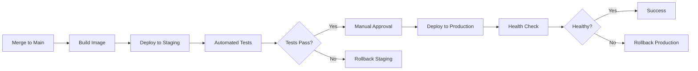

# Sales System Workflows

## Development Workflow

### Branch Strategy

We follow a trunk-based development model with short-lived feature branches:

```
main (production)
  ├── staging (pre-production testing)
  └── feature/* (feature branches, max 3 days old)
```

### Branch Naming Convention

```
feature/lead-scoring-algorithm
bugfix/territory-assignment-issue
hotfix/critical-pipeline-bug
refactor/opportunity-service-optimization
```

### Commit Guidelines

Follow Conventional Commits specification:

```bash
# Feature commits
git commit -m "feat(lead-service): add AI-powered lead scoring"

# Bug fixes
git commit -m "fix(opportunity): correct stage transition validation"

# Documentation
git commit -m "docs(api): update opportunity endpoints"

# Refactoring
git commit -m "refactor(territory): extract assignment logic to separate service"

# Performance improvements
git commit -m "perf(pipeline): optimize forecast calculation query"

# Tests
git commit -m "test(lead): add unit tests for qualification logic"
```

### Development Process

1. **Create Feature Branch**
   ```bash
   git checkout main
   git pull origin main
   git checkout -b feature/lead-scoring-algorithm
   ```

2. **Implement Changes**
   - Write code following TypeScript style guide
   - Add unit tests (min 80% coverage)
   - Update documentation
   - Run linter and formatter

3. **Local Testing**
   ```bash
   # Run unit tests
   npm run test:unit
   
   # Run integration tests
   npm run test:integration
   
   # Run linter
   npm run lint
   
   # Format code
   npm run format
   ```

4. **Submit Pull Request**
   - Push branch: `git push origin feature/lead-scoring-algorithm`
   - Create PR with template
   - Add description, screenshots, test results
   - Link related issues
   - Request reviewers

5. **Code Review**
   - Minimum 2 approvals required
   - Address review comments
   - Update PR based on feedback

6. **Merge to Main**
   - Squash commits
   - Delete feature branch
   - Automated deployment to staging

### Pull Request Template

```markdown
## Description
Brief description of changes

## Type of Change
- [ ] Feature
- [ ] Bug fix
- [ ] Performance improvement
- [ ] Refactoring
- [ ] Documentation

## Related Issues
Closes #123

## Changes Made
- Added AI-powered lead scoring algorithm
- Updated lead model with score field
- Added unit tests for scoring logic

## Testing
- [ ] Unit tests pass
- [ ] Integration tests pass
- [ ] Manual testing completed

## Performance Impact
- Lead scoring: 45ms average (target: <50ms)
- Database queries: 2 additional queries per lead

## Screenshots
(if applicable)

## Checklist
- [ ] Code follows style guide
- [ ] Tests added/updated
- [ ] Documentation updated
- [ ] No breaking changes
- [ ] Backwards compatible
```

## CI/CD Pipeline

### Continuous Integration

**Triggered on**: Every push to feature branch or PR

```yaml
stages:
  - lint
  - test
  - build
  - security

lint:
  script:
    - npm run lint
    - npm run format:check
  
test_unit:
  script:
    - npm run test:unit
    - npm run test:coverage
  coverage: '/Statements\s*:\s*(\d+\.\d+)%/'
  artifacts:
    reports:
      coverage_report:
        coverage_format: cobertura
        path: coverage/cobertura-coverage.xml

test_integration:
  script:
    - docker-compose up -d postgres redis
    - npm run test:integration
  
build:
  script:
    - docker build -t sales-system:${CI_COMMIT_SHA} .
    - docker tag sales-system:${CI_COMMIT_SHA} sales-system:latest

security_scan:
  script:
    - npm audit --audit-level=moderate
    - docker scan sales-system:${CI_COMMIT_SHA}
    - trivy image sales-system:${CI_COMMIT_SHA}
```

### Quality Gates

Pull requests must pass all quality gates:

| Gate | Requirement |
|------|-------------|
| Code Coverage | ≥80% |
| Linter | 0 errors |
| Unit Tests | 100% pass |
| Integration Tests | 100% pass |
| Security Scan | 0 critical/high vulnerabilities |
| Build | Success |
| Performance Tests | Within 10% of baseline |

### Continuous Deployment

**Triggered on**: Merge to main or staging branch

```yaml
deploy_staging:
  stage: deploy
  only:
    - staging
  script:
    - kubectl config use-context staging
    - kubectl set image deployment/sales-system sales-system=sales-system:${CI_COMMIT_SHA}
    - kubectl rollout status deployment/sales-system
  environment:
    name: staging
    url: https://staging-sales.ionoi-inc.com

deploy_production:
  stage: deploy
  only:
    - main
  when: manual  # Requires manual approval
  script:
    - kubectl config use-context production
    - kubectl set image deployment/sales-system sales-system=${CI_COMMIT_SHA}
    - kubectl rollout status deployment/sales-system
  environment:
    name: production
    url: https://sales.ionoi-inc.com
```

### Deployment Stages



## Testing Strategy

### Unit Tests

**Coverage Target**: ≥80% overall, ≥90% for business logic

**Framework**: Jest with TypeScript

**Example**: Lead Scoring Logic

```typescript
// tests/unit/services/lead-scorer.test.ts
import { LeadScorer } from '@/services/lead-scorer';
import { Lead } from '@/models/lead';

describe('LeadScorer', () => {
  let scorer: LeadScorer;

  beforeEach(() => {
    scorer = new LeadScorer();
  });

  describe('calculateScore', () => {
    it('should score qualified lead highly', () => {
      const lead: Lead = {
        industry: 'Technology',
        employee_count: 500,
        annual_revenue: 50000000,
        title: 'VP Engineering',
        engagement_score: 85
      };

      const score = scorer.calculateScore(lead);

      expect(score).toBeGreaterThanOrEqual(80);
      expect(score).toBeLessThanOrEqual(100);
    });

    it('should score unqualified lead lowly', () => {
      const lead: Lead = {
        industry: 'Unknown',
        employee_count: 5,
        annual_revenue: 100000,
        title: 'Student',
        engagement_score: 10
      };

      const score = scorer.calculateScore(lead);

      expect(score).toBeLessThan(30);
    });

    it('should weight engagement heavily', () => {
      const highEngagement: Lead = {
        engagement_score: 90,
        industry: 'Technology',
        employee_count: 100,
        annual_revenue: 1000000,
        title: 'Developer'
      };

      const lowEngagement: Lead = {
        ...highEngagement,
        engagement_score: 20
      };

      const highScore = scorer.calculateScore(highEngagement);
      const lowScore = scorer.calculateScore(lowEngagement);

      expect(highScore - lowScore).toBeGreaterThan(30);
    });
  });
});
```

### Integration Tests

**Framework**: Jest with Supertest for API testing

**Example**: Lead API Integration

```typescript
// tests/integration/api/leads.test.ts
import request from 'supertest';
import { app } from '@/app';
import { setupTestDatabase, teardownTestDatabase } from '@/tests/helpers/database';

describe('Lead API', () => {
  beforeAll(async () => {
    await setupTestDatabase();
  });

  afterAll(async () => {
    await teardownTestDatabase();
  });

  describe('POST /api/v1/leads', () => {
    it('should create a new lead', async () => {
      const leadData = {
        source: 'webinar',
        first_name: 'John',
        last_name: 'Doe',
        email: 'john.doe@example.com',
        company: 'Acme Corp',
        title: 'VP Engineering'
      };

      const response = await request(app)
        .post('/api/v1/leads')
        .set('Authorization', `Bearer ${testToken}`)
        .send(leadData)
        .expect(201);

      expect(response.body).toHaveProperty('id');
      expect(response.body.status).toBe('new');
      expect(response.body.email).toBe(leadData.email);
    });

    it('should reject duplicate email', async () => {
      const leadData = {
        email: 'duplicate@example.com',
        first_name: 'Test',
        last_name: 'User'
      };

      // Create first lead
      await request(app)
        .post('/api/v1/leads')
        .set('Authorization', `Bearer ${testToken}`)
        .send(leadData)
        .expect(201);

      // Attempt duplicate
      await request(app)
        .post('/api/v1/leads')
        .set('Authorization', `Bearer ${testToken}`)
        .send(leadData)
        .expect(409);
    });
  });

  describe('GET /api/v1/leads', () => {
    it('should return leads with pagination', async () => {
      const response = await request(app)
        .get('/api/v1/leads?limit=10&offset=0')
        .set('Authorization', `Bearer ${testToken}`)
        .expect(200);

      expect(response.body.data).toBeInstanceOf(Array);
      expect(response.body.pagination).toHaveProperty('total');
      expect(response.body.pagination).toHaveProperty('has_more');
    });

    it('should filter by status', async () => {
      const response = await request(app)
        .get('/api/v1/leads?status=qualified')
        .set('Authorization', `Bearer ${testToken}`)
        .expect(200);

      response.body.data.forEach((lead: any) => {
        expect(lead.status).toBe('qualified');
      });
    });
  });
});
```

### End-to-End Tests

**Framework**: Playwright

**Example**: Lead-to-Opportunity Conversion Flow

```typescript
// tests/e2e/lead-conversion.spec.ts
import { test, expect } from '@playwright/test';

test.describe('Lead to Opportunity Conversion', () => {
  test('should convert qualified lead to opportunity', async ({ page }) => {
    // Login
    await page.goto('/login');
    await page.fill('[name="email"]', 'test@ionoi-inc.com');
    await page.fill('[name="password"]', 'password');
    await page.click('button[type="submit"]');

    // Navigate to leads
    await page.click('text=Leads');
    await expect(page).toHaveURL('/leads');

    // Search for qualified lead
    await page.fill('[name="search"]', 'john.doe@example.com');
    await page.click('button:has-text("Search")');

    // Open lead details
    await page.click('text=John Doe');
    await expect(page.locator('text=Qualified')).toBeVisible();

    // Convert to opportunity
    await page.click('button:has-text("Convert to Opportunity")');

    // Fill opportunity form
    await page.fill('[name="name"]', 'Acme Corp - Enterprise Plan');
    await page.fill('[name="amount"]', '120000');
    await page.selectOption('[name="stage"]', 'discovery');
    await page.fill('[name="expectedCloseDate"]', '2026-04-30');
    await page.click('button:has-text("Create Opportunity")');

    // Verify opportunity created
    await expect(page.locator('text=Opportunity created successfully')).toBeVisible();
    await expect(page).toHaveURL(/\/opportunities\/[a-f0-9-]+/);
    await expect(page.locator('text=Discovery')).toBeVisible();
  });
});
```

### Performance Tests

**Framework**: Artillery

**Example**: Load Test Configuration

```yaml
# tests/performance/load-test.yml
config:
  target: 'https://api-staging.ionoi-inc.com'
  phases:
    - duration: 60
      arrivalRate: 10
      name: "Warm up"
    - duration: 300
      arrivalRate: 50
      name: "Sustained load"
    - duration: 120
      arrivalRate: 100
      name: "Peak load"
  processor: "./processor.js"

scenarios:
  - name: "Lead Creation"
    weight: 30
    flow:
      - post:
          url: "/api/v1/leads"
          headers:
            Authorization: "Bearer {{ $processEnvironment.TEST_TOKEN }}"
          json:
            source: "webinar"
            first_name: "{{ $randomString() }}"
            last_name: "{{ $randomString() }}"
            email: "{{ $randomString() }}@example.com"
            company: "Test Corp"

  - name: "Opportunity Pipeline"
    weight: 50
    flow:
      - get:
          url: "/api/v1/opportunities/pipeline?owner_id={{ randomUserId }}"
          headers:
            Authorization: "Bearer {{ $processEnvironment.TEST_TOKEN }}"
          expect:
            - statusCode: 200
            - contentType: json
            - hasProperty: summary

  - name: "Lead Search"
    weight: 20
    flow:
      - get:
          url: "/api/v1/leads?status=qualified&limit=50"
          headers:
            Authorization: "Bearer {{ $processEnvironment.TEST_TOKEN }}"
          expect:
            - statusCode: 200
            - maxResponseTime: 200
```

## Monitoring and Alerting

### Key Metrics

#### Application Metrics

```typescript
// Instrumentation with Prometheus
import { Counter, Histogram, Gauge } from 'prom-client';

export const metrics = {
  leadCreated: new Counter({
    name: 'sales_lead_created_total',
    help: 'Total number of leads created',
    labelNames: ['source', 'status']
  }),

  opportunityStageChange: new Counter({
    name: 'sales_opportunity_stage_change_total',
    help: 'Total opportunity stage changes',
    labelNames: ['from_stage', 'to_stage']
  }),

  apiRequestDuration: new Histogram({
    name: 'sales_api_request_duration_seconds',
    help: 'API request duration in seconds',
    labelNames: ['method', 'route', 'status_code'],
    buckets: [0.01, 0.05, 0.1, 0.5, 1, 2, 5]
  }),

  activePipeline: new Gauge({
    name: 'sales_active_pipeline_amount',
    help: 'Total amount in active pipeline',
    labelNames: ['stage', 'territory']
  })
};
```

#### Dashboard Configuration

**Grafana Dashboard**: Sales System Overview

Panels:
1. **Request Rate** (queries/second)
2. **Response Time** (p50, p95, p99)
3. **Error Rate** (%)
4. **Lead Creation Rate** (leads/hour)
5. **Pipeline Value** ($)
6. **Conversion Rate** (%)
7. **Database Connection Pool** (active/idle)
8. **Cache Hit Rate** (%)

### Alert Rules

```yaml
# prometheus/alerts.yml
groups:
  - name: sales_system
    interval: 30s
    rules:
      - alert: HighErrorRate
        expr: rate(sales_api_errors_total[5m]) > 0.01
        for: 5m
        labels:
          severity: critical
        annotations:
          summary: "High error rate detected"
          description: "Error rate is {{ $value }}% over the last 5 minutes"

      - alert: SlowAPIResponse
        expr: histogram_quantile(0.95, rate(sales_api_request_duration_seconds_bucket[5m])) > 0.5
        for: 10m
        labels:
          severity: warning
        annotations:
          summary: "API response time degraded"
          description: "P95 response time is {{ $value }}s"

      - alert: DatabaseConnectionPoolExhausted
        expr: sales_db_connections_active / sales_db_connections_max > 0.9
        for: 5m
        labels:
          severity: critical
        annotations:
          summary: "Database connection pool nearly exhausted"
          description: "{{ $value }}% of connections in use"

      - alert: LeadCreationFailure
        expr: rate(sales_lead_creation_failures_total[15m]) > 0.05
        for: 5m
        labels:
          severity: warning
        annotations:
          summary: "Lead creation failure rate elevated"
          description: "{{ $value }}% of lead creations failing"

      - alert: OpportunityConversionDrop
        expr: rate(sales_opportunity_conversions_total[1h]) < rate(sales_opportunity_conversions_total[1h] offset 1d) * 0.5
        for: 30m
        labels:
          severity: warning
        annotations:
          summary: "Opportunity conversion rate dropped significantly"
          description: "Conversion rate is 50% below yesterday's rate"
```

### Logging Standards

```typescript
// Use structured logging with context
import { Logger } from '@/lib/logger';

const logger = new Logger('lead-service');

// Info logs
logger.info('Lead created', {
  leadId: lead.id,
  source: lead.source,
  assignedTo: lead.assigned_to,
  duration: Date.now() - startTime
});

// Warning logs
logger.warn('Lead score below threshold', {
  leadId: lead.id,
  score: lead.score,
  threshold: 50
});

// Error logs with stack traces
logger.error('Failed to create lead', {
  error: error.message,
  stack: error.stack,
  input: sanitizeInput(leadData),
  requestId: req.id
});

// Debug logs (only in development)
logger.debug('Territory assignment calculated', {
  leadId: lead.id,
  matchedTerritories: territories.map(t => t.id),
  selectedTerritory: selectedTerritory.id,
  reason: assignmentReason
});
```

## Incident Response

### Incident Severity Levels

| Level | Description | Response Time | Escalation |
|-------|-------------|---------------|------------|
| P0 - Critical | Complete system outage | 15 minutes | Immediate page |
| P1 - High | Major feature broken | 1 hour | Page on-call |
| P2 - Medium | Minor feature impact | 4 hours | Notify team |
| P3 - Low | Cosmetic issue | Next business day | Create ticket |

### On-Call Rotation

- Primary on-call: 24/7 coverage, 1-week rotation
- Secondary on-call: Backup escalation
- Manager escalation: P0 incidents or primary unresponsive

### Incident Response Process

1. **Detection**: Alert triggers or user report
2. **Acknowledge**: On-call engineer acknowledges within 15 minutes
3. **Assess**: Determine severity and impact
4. **Communicate**: Post incident channel update
5. **Mitigate**: Implement immediate fix or rollback
6. **Resolve**: Deploy permanent fix
7. **Post-Mortem**: Document root cause and prevention

### Rollback Procedure

```bash
# Immediate rollback to previous version
kubectl rollout undo deployment/sales-system

# Rollback to specific revision
kubectl rollout undo deployment/sales-system --to-revision=42

# Verify rollback
kubectl rollout status deployment/sales-system

# Check health
curl https://api.ionoi-inc.com/health
```

### Communication Template

```
🚨 INCIDENT: Sales System - Lead Creation Failing

Severity: P1
Status: Investigating
Impact: Users unable to create new leads (50% error rate)
Started: 2026-02-11 08:15 UTC
On-Call: @jane-smith

Current Actions:
- Investigating database connection issues
- Reviewing recent deployments
- Analyzing error logs

Updates will be posted every 15 minutes.
```

## Release Process

### Version Numbering

Semantic Versioning: `MAJOR.MINOR.PATCH`

- **MAJOR**: Breaking API changes
- **MINOR**: New features (backwards compatible)
- **PATCH**: Bug fixes

### Release Checklist

- [ ] All tests passing
- [ ] Documentation updated
- [ ] CHANGELOG updated
- [ ] Version bumped
- [ ] Release notes drafted
- [ ] Security scan passed
- [ ] Performance benchmarks met
- [ ] Staging deployment successful
- [ ] Smoke tests passed
- [ ] Stakeholder approval
- [ ] Production deployment scheduled
- [ ] Rollback plan documented

### Release Notes Template

```markdown
# Sales System v2.5.0

Released: 2026-02-11

## New Features
- AI-powered lead scoring algorithm
- Territory auto-assignment based on firmographic data
- Enhanced pipeline forecasting with ML predictions

## Improvements
- Reduced opportunity search latency by 40%
- Optimized database queries for pipeline views
- Improved error messages for validation failures

## Bug Fixes
- Fixed duplicate lead detection (#245)
- Corrected territory conflict resolution (#267)
- Resolved forecast calculation edge cases (#289)

## Breaking Changes
None

## Migration Notes
- New `score` field added to leads table (auto-calculated)
- Territory assignment rules updated (automatic migration)

## Known Issues
- Lead import from CSV limited to 1000 records (#301)
```

## Best Practices

### Code Style

- Follow TypeScript strict mode
- Use async/await over callbacks
- Prefer interfaces over types
- Document public APIs with JSDoc
- Keep functions small and focused
- Use meaningful variable names

### Security

- Never commit secrets or API keys
- Use environment variables for configuration
- Validate and sanitize all inputs
- Implement rate limiting
- Log security-relevant events
- Keep dependencies updated

### Performance

- Use database indexes strategically
- Cache frequently accessed data
- Implement pagination for large datasets
- Optimize database queries
- Use connection pooling
- Monitor query performance

### Testing

- Write tests before fixing bugs
- Aim for high code coverage
- Use test doubles (mocks/stubs) sparingly
- Test edge cases and error paths
- Keep tests fast and isolated
- Run tests locally before pushing
